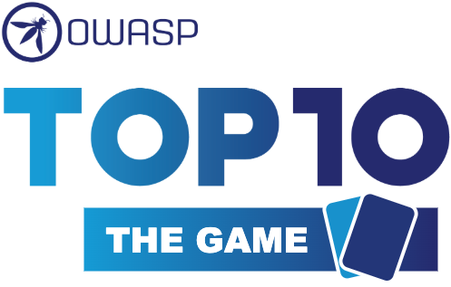

### Quick Links
* Website
    * [Top10TheGame.org](http://top10thegame.org/en)
    
### Project Information

* <i class="fas fa-flag" style="font-size: 1.3em; color:#1f95d3;"></i>
  Incubator Project

#### Classification

* <i class="fas fa-tools" style="color:#233e81;"></i> Board Game/Training/Education

#### Audience

* <i class="fas fa-toolbox" style="color:#233e81;"></i> Builder
* <i class="fas fa-hammer" style="color:#233e81;"></i> Breaker
* <i class="fas fa-shield-alt" style="color:#233e81;"></i> Defender

### Downloads
* [Base Game - Print&Play](https://raw.githubusercontent.com/AgentsWorkingTogether/OWASPTop10TheGame/main/game/cards.pdf)
* [Boards - Print&Play](https://github.com/AgentsWorkingTogether/OWASPTop10TheGame/tree/main/boards)
* [Team Building Extenstion - Print&Play](https://raw.githubusercontent.com/AgentsWorkingTogether/OWASPTop10TheGame/main/extensions/team-building/team_building_cards.pdf)

### Code Repository
* [Game](https://github.com/AgentsWorkingTogether/OWASPTop10TheGame)
* [OWASP Project](https://github.com/OWASP/www-project-top-10-the-game)

### Documentation

* [Rules](https://top10thegame.org/en/#how-to-play)
* [Characters](https://top10thegame.org/en/#characters)
* [Components](https://top10thegame.org/en/#components)
* [Team Building Extension](https://top10thegame.org/en/#team-building)

### Community

* [Slack Channel](https://owasp.slack.com/messages/project-owasp-top-10-the-game) ([Self-registration](https://owasp.org/slack/invite))

